# [2022-2023学年第2学期](https://js2023.pages.dev/#/lab/proj.final?id=_2022-2023学年第2学期)

# [**实 验 报 告**](https://js2023.pages.dev/#/lab/proj.final?id=实-验-报-告)


- 课程名称:跨平台脚本开发技术
- 实验项目: 期末大作业
- 专业班级<u>计算2002 </u>
- 学生学号<u> 32001019</u>
- 学生姓名<u> 司晨旭</u>
- 实验指导教师:郭鸣

## [实验内容

6. git 管理技术文档,和项目代码,可以使用 github desktop
   - 验收大作业的时候查看git log
   
     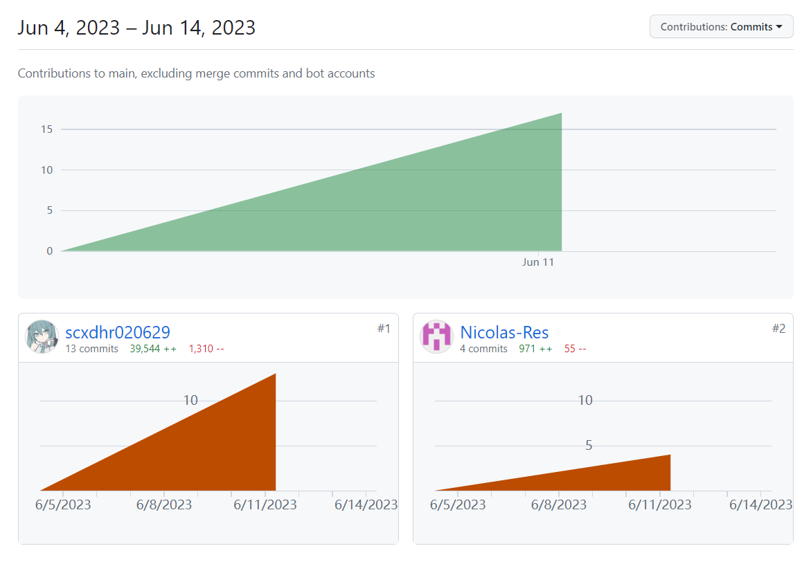
   
   - npm i -g git-stats
   
   - https://github.com/tomgi/git_stats/graphs/contributors
   
8. 项目分工表格

- 1人项目权重为1.0
- 2人项目权重和为 1.9

| 姓名   | 学号     | 班级       | 任务                                                         | 权重 |
| ------ | -------- | ---------- | ------------------------------------------------------------ | ---- |
| 司晨旭 | 32001019 | 计算机2002 | 地址管理模块 查询收货地址， 开发 登录模块 验证码登录功能，开发 个人中心模块 图片上传功能，vue前端的修改 | 1.2  |
| 阮修霖 | 32002233 | 软工2004   | 改进 分类模块 数据获取，开发 登录模块 注册功能 ，vue前端的开发 | 0.7  |

1. 项目自我评估表

| 技术点        | 自我评价 | 备注 |
| ------------- | -------- | ---- |
| Axios         | 4        |      |
| local Storage | 5        |      |
| 响应式编程    | 4        |      |
| 函数式编程    | 4        |      |
| token         | 4        |      |
| vue框架       | 4        |      |
|               | 4        |      |

1. 项目自评等级:(1-5)

   4.5

2. 项目说明

   1. 项目 搭建了vue前端和后端，做的是一个卖茶商城
      - 开发 地址管理模块
      
        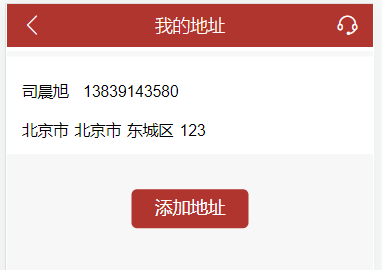
      
        点击添加地址 
      
        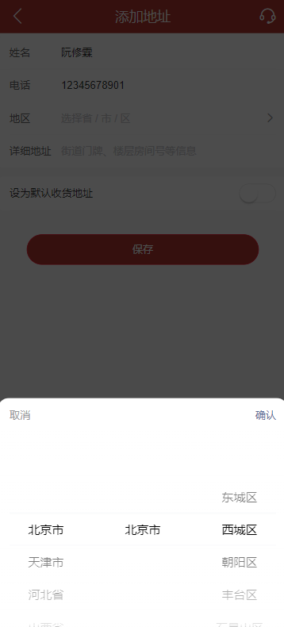
      
        
      
        
      
      - 改进 分类模块 数据获取
      
        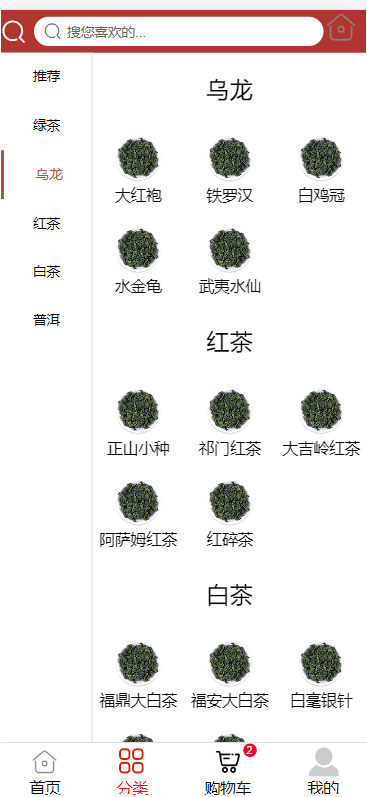
      
      - 开发 登录模块 注册功能
      
        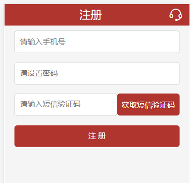
      
        
      
        可以看到mysql中添加了一行数据
      
      - 开发 登录模块 验证码登录功能
      
        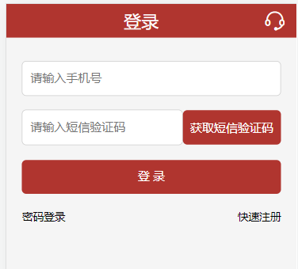
      
        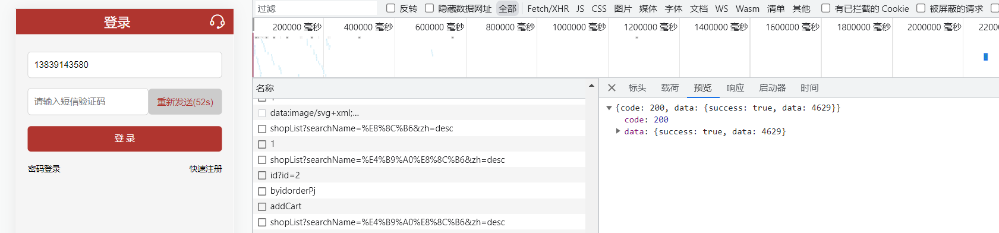
      
        输入code中的那个四个数字就可以登录进去
      
      - 开发 个人中心模块 图片上传功能
      
        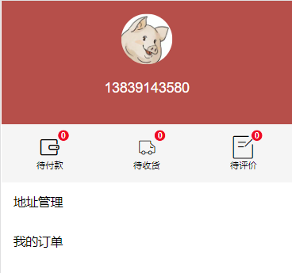
      
        小猪是原先的头像，然后我们双击一下会弹出来一个提交图片的按钮在页面中。要双击我们的按钮，然后把图片上传上去，比方说我们上传一只小马
      
        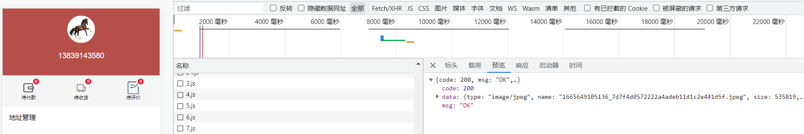
      
      - 实现购物车加入，支付订单一整套流程
      
        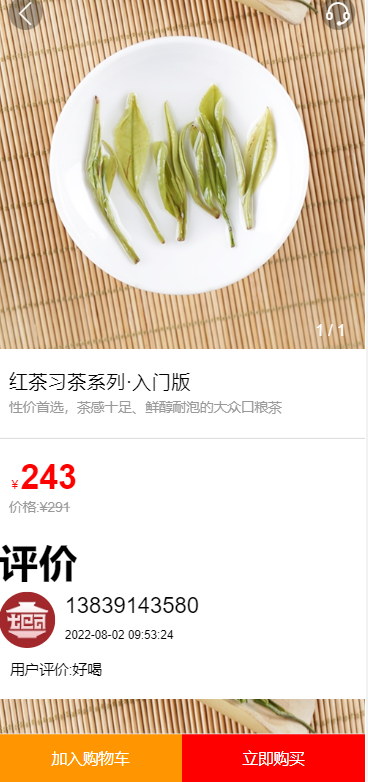
        
        点击加入购物车之后，商品就会进入到购物车里面
        
        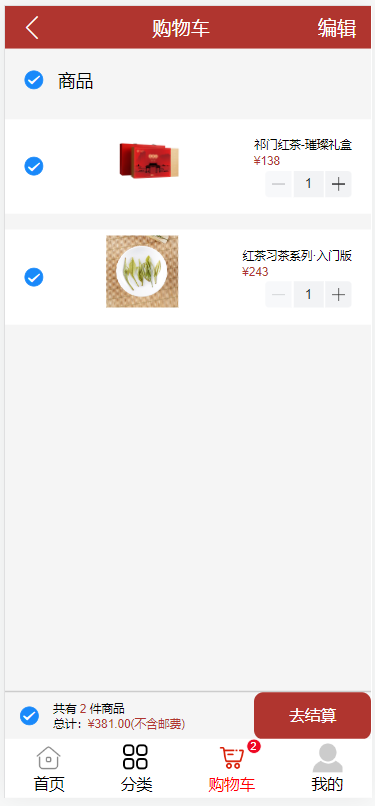
        
        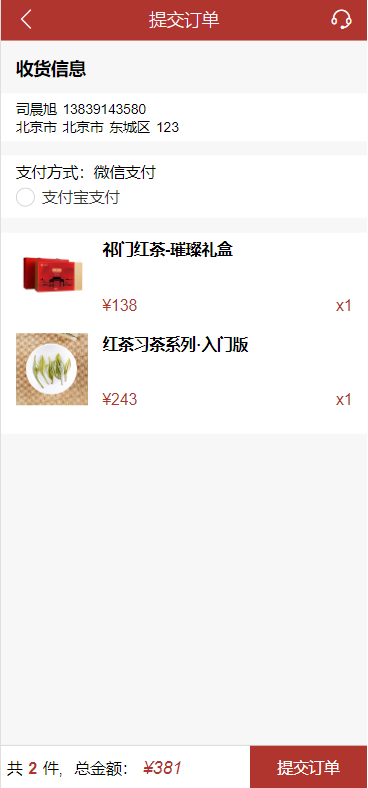
        
        

3. 解决技术要点说明

   - 解决 图片上传 问题， 关键代码与步骤如下

     在前端中使用了一个插件

     ```vue
     <el-upload
             action="/api/hold/imgload"
             :on-remove="handleRemove"
             :before-remove="beforeRemove"
             multiple
             :limit="5"
             :on-exceed="handleExceed"
             :file-list="fileList"
             :on-success="uploadSuccess"
             :data="paramsData"
           >
             <el-button size="small" type="primary">点击上传</el-button>
           </el-upload>
     ```

     使用post将图片URL上传至客户端

     ```js
     //图片上传
     router.post("/api/hold/imgload",
       multer({
         //设置文件存储路径
         dest: "../public/IMGURL",
       }).array("file", 1),
       function (req, res, next) {
         let files = req.files;
         let file = files[0];
         let fileInfo = {};
         console.log("找到api了");
         let path =
           "../public/IMGURL/" + Date.now().toString() + "_" + file.originalname;
         fs.renameSync("../public/IMGURL/" + file.filename, path);
         //获取文件基本信息
         fileInfo.type = file.mimetype;
         fileInfo.name = file.originalname;
         fileInfo.size = file.size;
         fileInfo.path = path;
         uploimg(path, req.body, fileInfo);
         res.send({
           code: 200,
           msg: "OK",
           data: fileInfo,
         });
       }
     );
     ```

     使用get方法获取在数据库中查询到的图片URL

     ```js
     //查看头像
     router.get("/api/getuserimg", function (req, res, next) {
       let userid = JSON.parse(req.query.id).id;
       connection.query(
         `select * from userimg where userid=${userid}`,
         function (error, result) {
           res.send({
             data: {
               success: true,
               code: 200,
               data: result,
             },
           });
         }
       );
     });
     ```

     我们把图片的信息上传到数据库中，然后在把图片重新渲染到前端即可

     

   - 解决 跨域问题， 关键代码与步骤如下

     要更改一下我们的配置文件还有api

     ```js
     devServer: {
     	  proxy: {
     	    '/api': {
     	      //target: "http://localhost:3000",
     	      target: "http://127.0.0.1:3000",
     	      changeOrigin: true,
     	      pathRewrite: {
     	        '^/api': '/api'
     	      }
     	    }
     	  },
     	},
     ```

     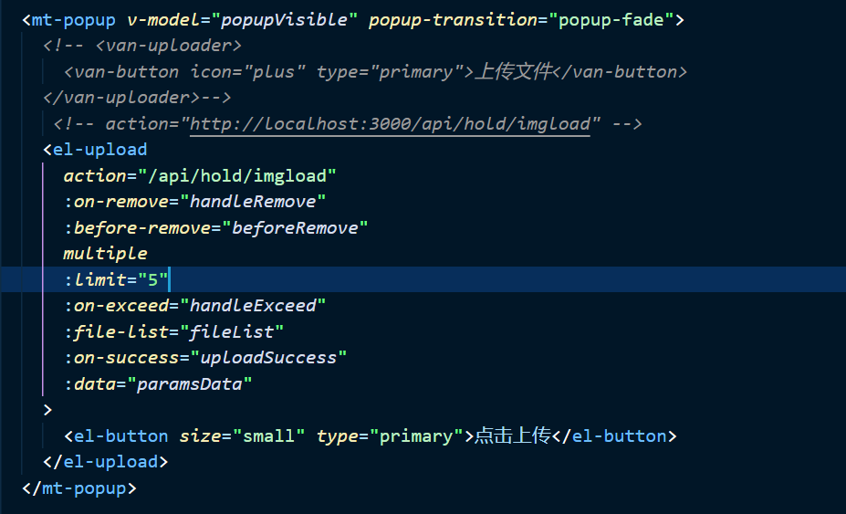
     
     这里当时做的时候非常纠结，甚至自己写了一段java程序开8081的端口来验证自己是否出了问题
     
     根据控制台上的报错解决了问题
     
   - 封装了一小下axios

     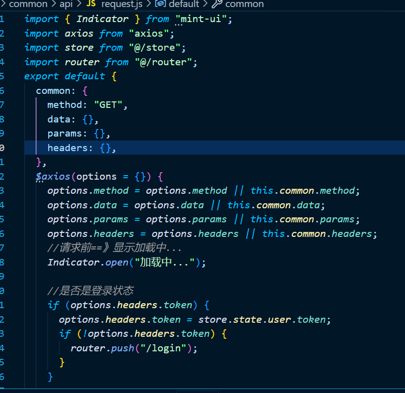

     同时我们也要在这里判断一下，是否是登录状态，如果不是的话把它跳转到登录。

   - 实现验证码的发送登录

     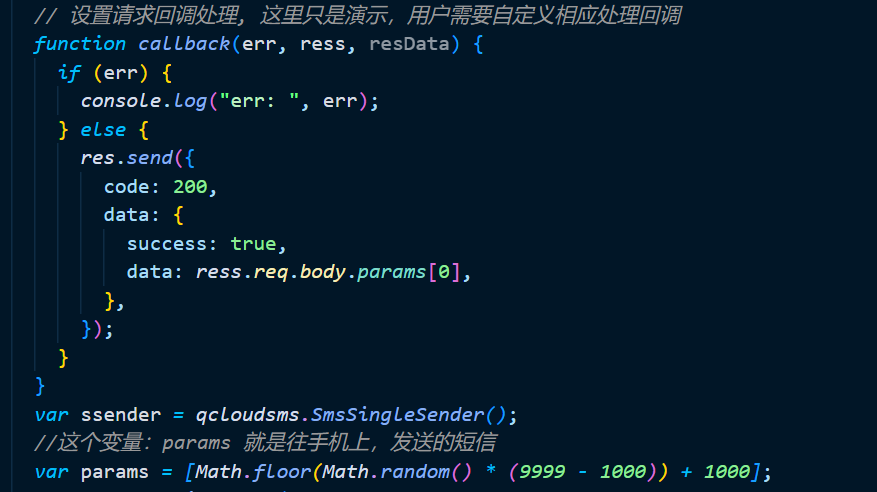

     其实这里就是生成了一个随机数，然后主要是在前端处理验证

     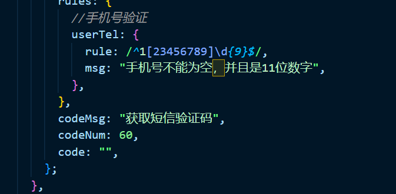

     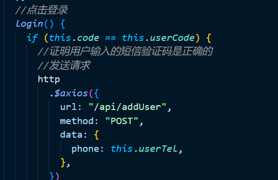

   - 数据库的设计

     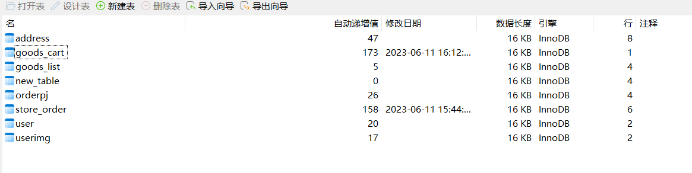
     
     - address表存放地址
     - goods_cart存放购物车商品
     - goods_list 猜你喜欢
     - new_table 这个表没有用，当时我们在处理用户信息的时候弄得
     - oderpj，存放得是对商品得评价
     - store_order 商品信息
     - user 存放用户信息
     - userimg存放用户的图片，头像

4. 心得体会（结合自己情况具体说明）

   - 大项目开发过程心得

     - 遇到哪些困难，经历哪里过程，有哪些收获

     - 司晨旭个人心得

       - 首先是对restapi的理解
   
         先前在软件架构那么课上，彭老师说，使用restapi主要是对资源的理解，并不是非要get，post，put，delete区分。可以全部改成post来使用，直接写清楚就好了
       
         在郭老师的课上，老师说要给他区分开。get就查询，post就上传。delete删除。
       
         因为我先上的软件架构这门课，所以我的编程习惯也就变成了一直用post，在和郭老师交流后，赶快把代码改成了get，post，delete来进行区分
       
         **但是由于先前直接使用post来传入一个数组来批量删除地址**，因此在post改delete的时候出了一些问题，只能删除第一个商品了，然后把商品列表以字符串的形式传入，在给他转成列表。比较麻烦
       
         不过最后还是实现了。所以时间其实有点紧张，因为是在最后了更改这些api
         
       - 跨域问题，我也不晓得改完配置文件之后怎么有时候还是会报这个错误
       
         就是在图片上传的时候，总是出错，一直报8080，可是我开的是3000的后端。始终访问不到。
       
         然后我将api的地址直接更改。解决掉了问题。
       
     - 阮修霖个人心得
   
       - 在写地址处理的时候，因为添加了默认地址的功能，所以处理起来比较困难。比方说添加地址，首先我们要判断这个地址是否是默认地址，如果不是默认地址我们就直接增加。然后呢如果是默认地址，那就要判断一下原先有没有默认地址。有的话把原先的默认地址改成不是默认的，然后再添加。
   
         就是想这种后端的逻辑判断，一层一层的sql语句套sql语句来保证数据的干净。里面的逻辑有时候有些复杂。
   
       - vue 前端调用后端的api的时候，有时候数据处理方面会出一些问题。比方说，读不到后端的数据，渲染顺序出问题。把数据获取到之后其实并不是想要的。而且在传数据的时候，有时候可以直接给后端要传一整套对象过去，有时候传一个id。这部分一定要两个人交流好，否则会出很大的问题。
   
   - 本课程建议
   
     - 课程难度方面，进度方面，课程内容，授课方式等，给出你的意见
   
       课程难度偏高，底层知识掌握要求程度高，希望老师能多引导学生从实践角度出发，通过项目理解底层知识。